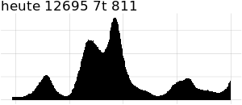

# RCoronaEpaper
* get corona data from https://covid19-dashboard.ages.at/data/data.zip
* create plot with r ggplot
* show plot on ePaper with python library RaspberryPi_JetsonNano

# ToDos
* use red plot in ePaper (python)
